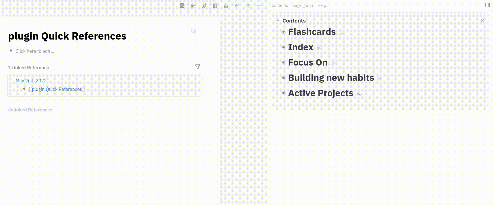

# Context

This plugin came out of my need doing [interstitial-journaling](https://nesslabs.com/interstitial-journaling) and refering my current project on this week or tags more used.
I'd like to avoid to type those things every time I changed the focus and subject on my journal, e.g. life/project/ABC or life/health/emotions, etc.

The current alternatives, without this plugin, would be:

- creating your own commands in the config.edn
- creating alias on the pages you want to mention

But both demands more work, and the second alternative asks for change in the content you write. 

# Using this plugin

So I thought that I could have a quick slash command or some shortcut.
Initially, for the first version, I did slash commands from 1 to 9 quick references for each of my most important things to the moment:
- /q1 Quick Reference
- /q2 Quick Reference
...
- /q9 Quick Reference

Each command get the related reference from the page "Contents" under some parent block named "Quick References".
All you need to do is to create something in the Contents page like this example:

- Quick References
  - [[life/project/ABC]]
  - #[[life/health/emotions]]
  - [[xyz]]
  - anything else
  - other
  - more

Note the lines under "Quick References". Each one corresponding to each slash command at the same order: /1 Quick Reference, /2 Quick Reference, /3 Quick Reference, etc.

So, when you are typing and want to mention some page set in the Contents, you just need to use those commands. To use in a quick way and make sense of using this plugin for quick refenrece just type /q{number of reference}, like /q2 and press ENTER.
In this way is easy to change the references when needed.

## Example on interstitial-journaling where I could use quick reference to mention some project or tag

- 09:33 [[life/project/ABC]] doing something 
- 09:41 researching about [[xyz]].
- 09:50 scrolling on twitter.
- 09:57 focusing again on [[life/project/ABC]]
- 10:18 #[[life/health/emotions]] feeling excited because...
- 09:41 researching about [[xyz]]
  - 10:37 I found that...
- 11:37 having lunch
- 13:01 continuing developing the component on [[life/project/ABC]]

# Credits

Thunder icon created by [Smashicons - Flaticon](https://www.flaticon.com/free-icons/thunder)
